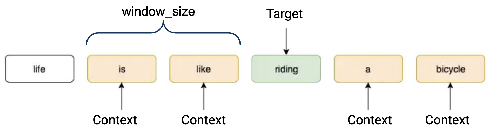
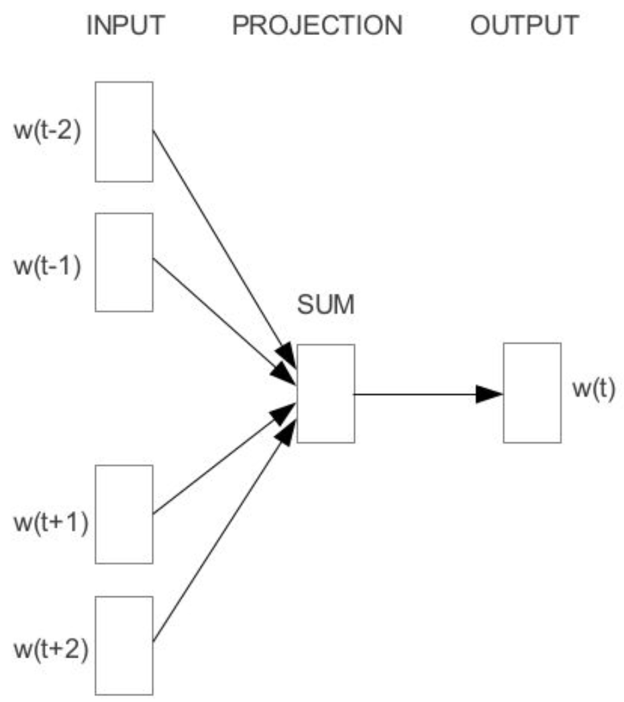
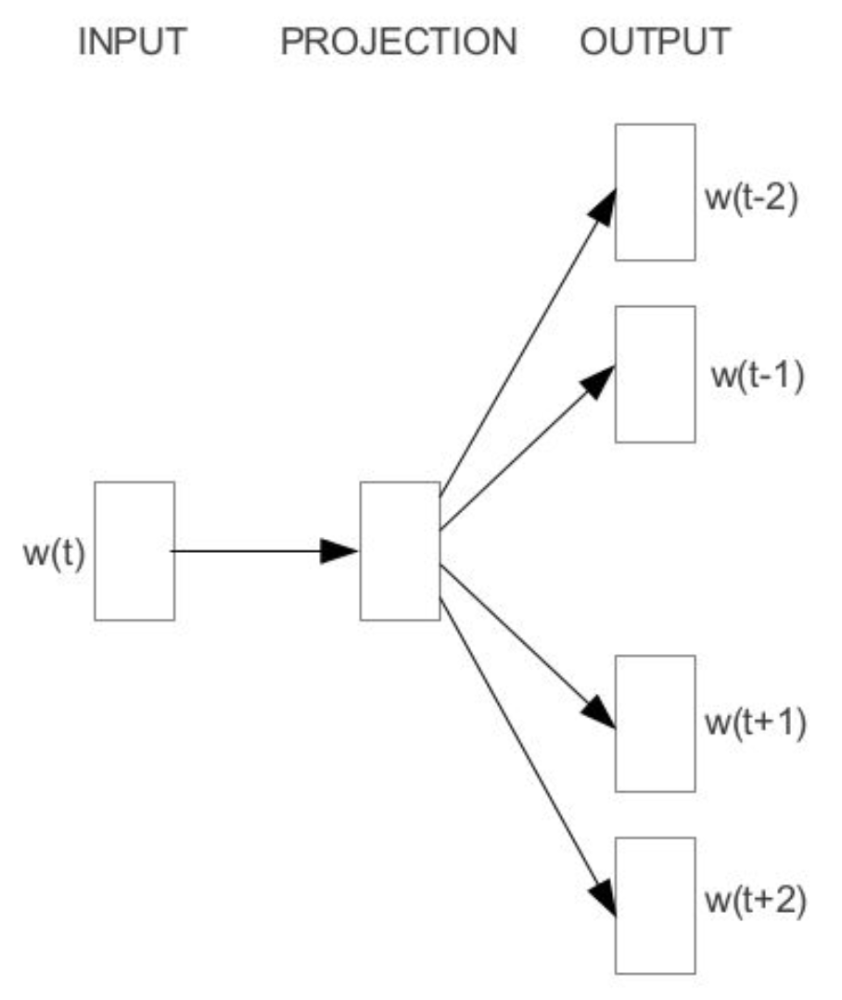
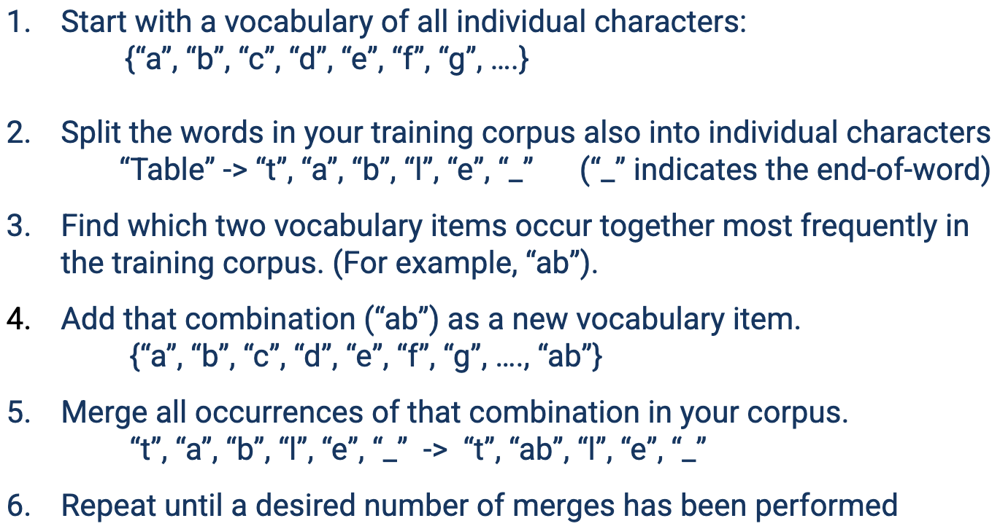

# Lecture 1: Word Embedding

## One Hot Encoding

假设字典有 $| V |$, 其第 $x$ 的单词的 Enc 则为 $[ 0, ..., 0, \underbrace{1}_{x-th}, 0, .., 0]$

## CBOW vs SkipGram

|                             CBOW                             |                           SkipGram                           |
| :----------------------------------------------------------: | :----------------------------------------------------------: |
|  |  |
|         $\text{Context Word} \to\text{Target Word}$          |        $\text{Target Word} \to\text{Context Word}  $         |

Skip Gram 模型可以被描述为
$$
O_w := \text{Word w's Onehot Enc, shape: } \in \mathbb{R}^{|V|}\\
H_w := \text{Word w's Skip Gram Embedding} \in \mathbb{R}^d\\
V:= \text{Vocabulary}\\
Model =\underbrace{O_w \times W_{\in |V| \times d}}_{H_w \in (d)} \times W'_{\in d \times |V|}\\
P(\text{context } c\mid \text{target} w) = \text{softmax}(Model()[c], Model)
$$
用完整的数学表示：
$$
h = xW\\
y = hW'\\
y' = \text{softmax}(y)
$$

### 优化

如果考虑一个有 $T$ 个单词的文档（即 T 个 target），则均质 likelihood 被定义为：
$$
\frac{1}{T}\sum^T_{t=1}\prod_{c\in \text{Context}} p(w_c \mid w_t ; \theta)
$$
入考虑 Context Window 为 $j$，则有
$$
\frac{1}{T}\sum^T_{t=1}\prod_{c\in [t-j,t+j], c\neq0} p(w_c \mid w_t ; \theta)
$$
常见的优化整理后得为
$$
\text{maxmise}_\theta\quad
\frac{1}{T}\sum^T_{t=1}\sum_{c = t-j, c\neq0}^{t+j} \log p(w_c \mid w_t ; \theta)\\
\text{minimise}_\theta\quad
- \frac{1}{T}\sum^T_{t=1}\sum_{c = t-j, c\neq0}^{t+j} \log p(w_c \mid w_t ; \theta)\\
$$
当然，也可以抛弃掉 $w_c$ 的定义（字面），写作
$$
\text{minimise}_\theta\quad
- \frac{1}{T}\sum^T_{t=1}\sum_{c = 1}^{j} \log p(w_{t\pm c} \mid w_t ; \theta)\\
$$
需要注意的是这里的 Softmax，考虑模型的形状
$$
\underbrace{\begin{bmatrix}
0 \\
0 \\
1 \\
0 \\
\end{bmatrix}^\top}_{X \in (1 \times |V|)}

\underbrace{\begin{bmatrix}
&  \vdots  &
\\
- & h_t  & -
\\
& \vdots & 
\\
\end{bmatrix}}_{W \in |V| \times d}

=

\underbrace{\begin{bmatrix}
|
\\
h_t
\\
|\\
\end{bmatrix}^\top}_{h_t \in 1\times d}

\qquad\qquad

\underbrace{\begin{bmatrix}
|
\\
h_t
\\
|\\
\end{bmatrix}^\top}_{h_t \in1\times d}

\underbrace{\begin{bmatrix}
& | &
\\
\dots & u_t  & \dots
\\
& | & 
\\
\end{bmatrix}}_{W' \in d \times |V|}

=
\underbrace{\begin{bmatrix}
y_1
\\
y_t
\\
y_{|V|}\\
\end{bmatrix}^\top}_{y_t \in 1\times |V|}
$$

Softmax 被定义为
$$
p(w_c \mid w_t) = \text{softmax} =
\frac{
\exp(u_c^\top h_t)
}{
\sum^{|V|}_{v} \exp(u_v^\top h_t)
}
=
\frac{
\exp(y_c)
}{
\sum^{|V|}_{v} \exp(y_v)
}
$$

### Negative Sampling

> **Motivation:** 考虑 softmax 分母里的求和操作，需要对整个字典做，非常的巨大，如果考虑 $|V| = 10,000, d=300$ 则需要做 $3,000,000$ 次feature-weight multiplications，对每个 embedding matrix 6M。
>
> **Approach:** 去近似 softmax。使用 binary classification 区分真实 context word 和 noise

$$
\text{maxmise}_\theta\quad
\log p(+\mid w_t, w_{t+1})+ k\cdot \mathbb{E}_{\epsilon\sim P_\text{noise}}[\log p(- \mid w_t, \epsilon)]
$$

需要注意，这里的 $\epsilon$ 是指negative word，而不是 numeric 的噪音。$k$ 表示采样 $k$ 个 negative word。

通过这一步，我们可以将预测写成：
$$
p(+ \mid w_t, w_{t+1}) = \frac{1}{1+\exp(-y_{t+1})}
= \frac{1}{1+\exp(-u_{t+1}^\top h_t)}
$$

> **选择 $k$**
> 对于小型数据集，5-20 个 negative words 工作良好
> 对于大型数据集，2-5个
>
> 如果考虑 $|V| = 10,000, d=300$，考虑更新 1 个 pos word，5 个neg sample，则需要更新 $6\times 300$ 个参数，其只占比输出矩阵（$3,000,000$ 个参数）很小的一部分。

## BPE: Byte Pair Encoding

