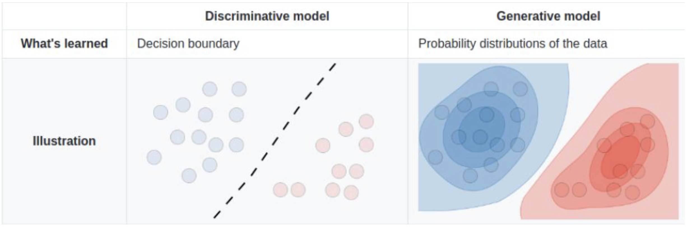
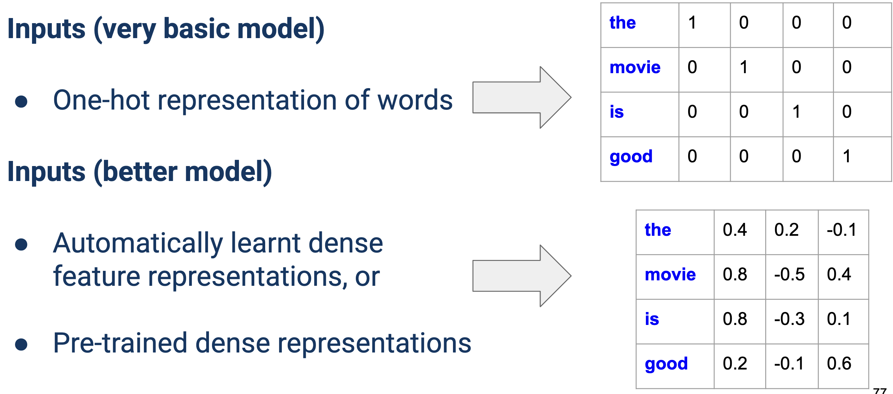

# Lecture 2: Classification

[TOC]

## Naive Bayes Model

### NB Backgroud

对于分类任务，我们可以认为我们是对如下进行建模：
$$
\hat{y} = \text{arg}\max_y p(y \mid x)
$$
我们拥有 Bayes Theorem:
$$
\underbrace{P(y\mid x)}_\text{posterior}
= \frac{
\overbrace{P(x\mid y)}^\text{likelihood}
\overbrace{P(y)}^\text{prior}
}{P(x)}
$$
因此可以把问题重写为
$$
\hat{y} = \text{arg}\max_y P(y \mid x)
\longrightarrow
\hat{y} = \text{arg}\max_y P(x \mid y)P(y)
$$
如若假设 $\mathbf{x} = \{ x_1, x_2, \cdots, x_N \}$，则问题为：
$$
\hat{y} = \text{arg}\max_y P(x_1, x_2,\cdots, x_N \mid y)P(y)
$$
考虑 NB 的 independent assumption：
$$
\because
P(x_1, x_2,\cdots, x_N \mid y) =
P(x_1\mid y)\cdot P(x_2\mid y)\cdot P(\cdots\mid y)\cdot P( x_N \mid y)
= \prod_i^N P(x_i \mid y)

\\
\therefore
\hat{y} = \text{arg}\max_y P(y) \prod_i^N P(x_i \mid y)
$$

### Preprocessing: Bag of Word (BoW)

对于一个文本的 BoW 表示为：

数据集被定义为文档的标签对：

### Training Model

在完成特征表示后，我们可以得到 prior（先验概率）（这可以通过聚合运算得到）。

假设训练集如上，则 prior 为
$$
\begin{cases}
P(+) = \frac{3}{5}\\
P(-) = \frac{2}{5}
\end{cases}
$$
我们也可以获得 likelihood，以 good 为例
$$
P(\text{good} \mid +) = \frac{2}{4}
$$

这里涉及到的运算矩阵为上，good 出现了2次，而总词数为 4（2 good，1 movie，1 bad）
$$
\begin{align*}
P(w \mid c)
&= \frac{\text{word }w \text{ count in class } c}{\text{total word in class } c}
\\
&= \frac{\text{count}(w, c)}{\sum_{x\in V} \text{count}(x, c)}

\end{align*}
$$
为防止出现计数为 0 情况，使用 **Add-One Smoothing**:
$$
\begin{align*}
P(w \mid c)
&= \frac{\text{count}(w, c) +1}{\sum_{x\in V} (\text{count}(x, c)+1)}
\\
&= \frac{\text{count}(w, c) +1}{|V| + \sum_{x\in V} \text{count}(x, c)}
\end{align*}
$$
因此：
$$
P(\text{good} \mid +) = \frac{2}{4} \rightarrow\frac{2+1}{4+1} = \frac{3}{5}
$$

### Improvement

#### Improvement: Binary NB

Not as **good** as the **old** **movie**, rather **bad** **movie**. -> Not as **good** as the **old** **movie**, rather **bad** ~~movie~~.

移除了每个实例中的所有重复项。因此，单词“movie”的额外出现不会改变任何内容。

请注意，这意味着需要根据数据重新计算条件概率。

#### Improvement: Negation Control `NOT_`

I didn’t like the movie, but it was better than Top Gun -> I did**n’t** *NOT_like NOT_the NOT_movie*, but it was better than Top Gun

对于所有  logical negation (e.g., n’t, not, no, never) 后 append `NOT_` 直到下一个 punctuation。

## Logistic Regression

Discriminative algorithms 学习 $P( Y \mid X)$
Generative models 学习 $P(X, Y)$
$$
y(x) = g(z) = \frac{1}{1+e^{-z}}\\
\text{where }z = w^\top x + b
$$

损失函数通过 BCE 定义。我们先定义 neg likelihood (min neg likelihood)
$$
H(P, Q) = -\sum_cP(c)\log Q(c)
$$
如有
$$
\begin{cases}
P =[1, 0]\\
Q_1 = [0.92, 0.08]
\end{cases}
$$

$$
H(P, Q_1) = - 1 \log0.92 - 0 \log 0.08 = 0.08
$$

对于多class，用 softmax

## NN

### 定维表示（Fixed-Dimension Representation）

对于不同的句子，为获得固定维度的句子文档表示

#### 不好：均值表示

可以用平均值：

这真是个馊主意：
根据句子长度大小固定模型结构
针对特定单词位置学习模型权重

自动学习的特征 Auto Learnt Features

- 灵活适应数据中高度复杂的关系
- 但是：它们需要更多数据来学习更复杂的 patterns

## Recurrent Neural Networks (RNNs)

$$
h_{t+1} = f(x_t, h_{t}) = \tanh (W_{hh}h_{t} + W_{xh} x_t)\\
y_{t+1} = W_{hy} h_{t+1} + b_y
$$

$$
\begin{cases}
W=W_{hh} & \in \mathbb{R}^{H \times H}
\\
U=W_{xh} & \in \mathbb{R}^{X\times H}
\\
O= W_{hy} & \in \mathbb{R}^{H \times Y}
\end{cases}
$$

模型难以从较早的输入中学习：

- Tanh 的导数在 0 到 1 之间

- Sigmoid 的导数在 0 到 0.25 之间

较早层的梯度涉及同一矩阵 $W$ 的重复乘法

- 根据主导特征值（dominant eigenvalue），这可能导致梯度“消失”或“爆炸”

> 而由于 RNN 的循环结构，在反向传播过程中，对于 $h_0$ 计算梯度时，导致很多梯度会相乘，从而导致梯度可能会指数级地减小（消失）或增大（爆炸）。这会导致学习困难，尤其是对于长序列。
>
> 如果梯度很多都 $>1$，则会导致梯度爆炸（考虑 $1.01^{100}$），我们可以通过梯度裁剪（Gradient Clipping）来解决这个问题。即当梯度的范数超过一个阈值时，将梯度缩放到一个较小的范围。
>
> 如果梯度很多都 $<1$，则会导致梯度消失，这个问题比较难解决，我们通常会使用

## Convolutional Neural Networks (CNNs)

Filter：在一个方向上对整行（单词）进行滑动窗口

- Filter width = embedding dimension
- Filter height = normally 2 to 5 (bigrams to 5-grams)

我们不知道最后会有多少维（因为输入长度不确定），但是我们可以做的 $d$ 个 filter，然后对 $d$ 个 filter 取 maxpooling（每一个 filter 的结果取最大值）形成一个 $d$ 维的向量。

RNNs vs CNNs（循环神经网络与卷积神经网络的对比）

- CNNs（卷积神经网络）在涉及关键短语识别的任务中表现出色（key phrase recognition）
- RNNs（循环神经网络）在需要理解长距离依赖关系时表现更好

## Metrics

> https://mlbook.dev/Practice/Metrics.html

$$
\begin{align*}
F_1
&=\frac{2\cdot\text{Precision}\cdot\text{Recall}}
{\text{Precision}+\text{Recall}}
\\
&= \frac{TP}{TP + \frac{1}{2}(FP+FN)}

\end{align*}
$$

## Appendix

$$
\text{Conditional Independence} \nrightarrow \text{Independence}
\\
\text{i.e. } P(A\mid C)\perp P(B\mid C) \nrightarrow P(A) \perp P(B)
$$

$$
\text{Independence} \nrightarrow \text{Conditional Independence}
\\
\text{i.e. } P(A) \perp P(B)  \nrightarrow P(A\mid C)\perp P(B\mid C) 
$$

> **例子**
>
> - 设 A = "学生数学得 A"
> - 设 B = "学生英语得 A"
> - 设 C = "学生熬夜学习"
>
> 最初，数学得 A（A）和英语得 A（B）可能是独立事件 - 一个科目的成功并不一定意味着另一个科目也会成功。
>
> 但是，当我们在给定 C（熬夜学习）的条件下：
>
> - 如果我们知道一个学生熬夜学习（C），那么数学考得不好（非 A）可能表明他们把时间花在学习英语上，这使得他们在英语上表现更好（B）的可能性更大
> - 同样，数学考得好（A）可能表明他们把熬夜时间用在了数学上，这使得他们在英语上表现较差（非 B）的可能性更大
>
> 我们可以用数学表达式来表示这一点： 虽然 $P(A,B) = P(A)P(B)$（独立性） 
> 但我们可能发现 $P(A,B|C) \neq P(A|C)P(B|C)$（条件依赖）
>
> 被称为伯克森悖论或碰撞偏差。