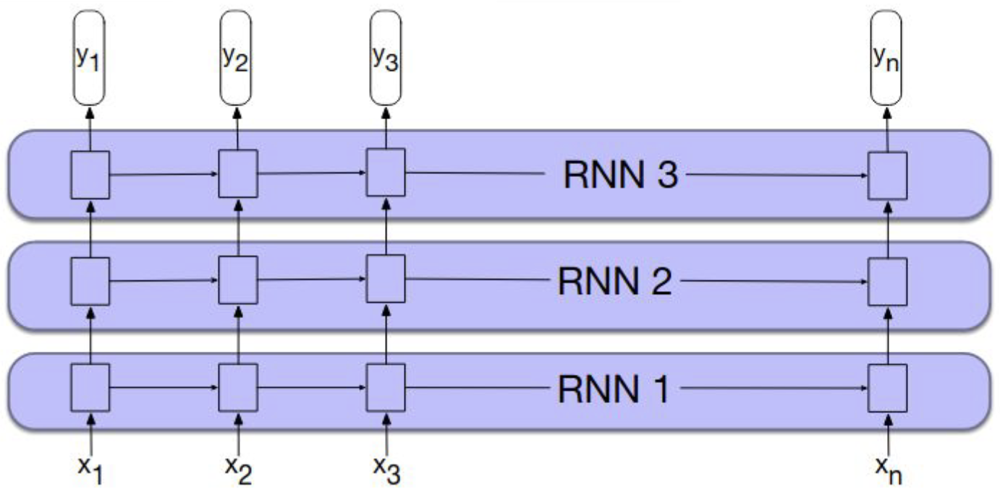

# Lecture 3.2 Language Models

[TOC]

## Sparsity

如果遇到未见过的词，例如 OOV，该怎么办？考虑概率定义
$$
P(w_1, \dots, w_n) = \prod^n_{k=1}P(w_k \mid w^{k-1}_1)
$$

- Add-1 Smoothing
- Back-off
- Interpolation

### Add-1 Smoothing

$$
P_\text{add-1}(w_n\mid w_{n-1})
= \frac{C(w_n, w_{n-1})+1}{C(w_{n-1} ) +V}
$$

After Add 1

### Back off Smoothing

Example: 如果没有 His Royal Highness, 可以回退到 Royal Highness

#### Stupid Back-off

$$
S(w_i\mid w_{i-2}w_{i-1})
=
\begin{cases}

\frac
{C(w_{i-2} w_{i-1} w_i)}
{C(w_{i-2} w_{i-1})}
&\text{if }C(w_{i-2} w_{i-1}w_i) > 0

\\
0.4 \cdot S(w_i\mid w_{i-1})
&\text{otherwise}
\end{cases}
$$

$$
S(w_i\mid w_{i-1})
=
\begin{cases}

\frac
{C(w_{i-1} w_i)}
{C(w_{i-1})}
&\text{if }C( w_{i-1} w_i) > 0

\\
0.4 \cdot S(w_i)
&\text{otherwise}
\end{cases}
$$

$$
S(w_i) = \frac{C(w_i)}{N}
$$

$N$ = Number of Words in the tex

> 这个模型在实践中通常表现良好，但在某些情况下会失效。
>
> 例如，假设二元组'a b'和一元组'c'非常常见，但三元组'a b c'从未出现过。由于'a b'和'c'都非常常见，'a b c'从未出现是很有意义的 Significant（即不是由于偶然）。
>
> 这可能是因为语法规则不允许。但该方法不会赋予更合适的0值，而是会退回到二元组并估计P(c|b)，这个值可能会过高。

### Interpolation

$$
\begin{align*}
P_\text{interp}(w_i \mid w_{i-2}w_{i-1})
=&

\lambda_1 P(w_i \mid w_{i-2}w_{i-1})

\\&+
\lambda_2 P(w_i \mid w_{i-1})
\\&+
\lambda_3 P(w_i)
\\
\lambda_1 + \lambda_2+\lambda_3 =&1
\end{align*}
$$

## 4 gram FFLM: Feed-forwad LM

第一个 Neural LMs到成功尝试，相比于 Smoothed 3-gram 提升了 10-20% 的Perplexity

## RNN

### Vanilla RNN

#### Many to 1 (M:1)

#### Many to Many (M:M)

> **为什么使用对数概率（log probability）**
>
> 1. 数值稳定性：
>
> - 原始概率值通常很小（因为是连乘），容易造成数值下溢
> - 取对数后将乘法转换为加法，避免了数值计算问题
> - 例如 0.0001 * 0.0001 = 0.00000001，但 log(0.0001) + log(0.0001) = -9.21
>
> 1. 损失函数优化：
>
> - 交叉熵损失使用对数概率更容易优化
> - 对数函数可以将(0,1)区间的概率值映射到(-∞,0)，使梯度更稳定
> - 在反向传播时，求导也更简单直观
>
> 1. 概率加法：
>
> - 语言模型通常需要计算序列的联合概率
> - 使用对数概率可以把概率的乘法转化为加法
> - P(w1,w2) = P(w1)P(w2) → logP(w1,w2) = logP(w1) + logP(w2)
>
> 1. 模型评估：
>
> - 困惑度（perplexity）等评估指标直接使用对数概率计算

Teaching Forcing

### Bi-Directional RNN

BiRNN 可以用来做语法检测:
$$
MLP([h^\rarr_t; h^\larr_t])
$$
也可以做分类任务
$$
MLP([h^\rarr_N, h_1^\larr])
$$

### Multi-Layered RNN

#### Bidirectional Multi-Layered RNNs

## LSTM

引入 Cell States $C_t$ 以表示长期记忆
隐藏层 $h_t$ 表示短期记忆

我们有如下 Gates:

- $i_t \in [0,1]$: Input Gate
- $f_t \in [0,1]$: Forget Gate
- $o_t \in [0,1]$: Output Gate

$$
\begin{align*}
i_t &= \sigma(
  W_{xi} x_t
  + W_{hi}h_{t-1}
  + b_i
)
\\
f_t &= \sigma(
  W_{xf} x_t
  + W_{hf} h_{t-1}
  + b_f
)
\\
o_t &= \sigma(
  W_{xo}x_t
  + W_{ho}h_{t-1}
  + b_o
)

\\
g_t &= \tanh(
  W_{xg}x_t
  + W_{hg}h_{t-1}
  + b_g)

\\
\\
c_t &= f_t\odot c_{t-1} +i_t \odot g_t

\\
h_t &= o_t \odot \tanh(c_t) 

\end{align*}
$$

这里面有参数
$$
\begin{align*}
W_{xi} & \in (H \times X) \\
W_{hi} & \in (H \times H) \\
b_i    & \in (H \times 1) \\
\\
W_{xo} & \in (H \times X) \\
W_{ho} & \in (H \times H) \\
b_o    & \in (H \times 1) \\
\\
W_{xf} & \in (H \times X) \\
W_{hf} & \in (H \times H) \\
b_f    & \in (H \times 1) \\
\\
W_{xg} & \in (H \times X) \\
W_{hg} & \in (H \times H) \\
b_g    & \in (H \times 1) \\
\end{align*}
$$
也就是
$$
\begin{align*}
W_{xi},
W_{xo},
W_{xf},
W_{xg}
& \in (H \times X) \\

W_{hi},
W_{ho},
W_{hf},
W_{hg} & \in (H \times H) \\
b_i,
b_o,
b_f,
b_g    & \in (H \times 1) \\
\end{align*}
$$

> Example
>
> 如果有 100 维的 Hidden States，500 维的 Embedding，任务为5分类
>
> 5分类 = (100 x 5)
>
> 因此结果为 $(100\cdot500+ 100\cdot 100 + 100) \times 4+100\cdot 5$
>
> 对于 BiLSTM 则为
>
> $(100\cdot500+ 100\cdot 100 + 100) \times (4\times 2) +(100\times 2)\cdot 5$

> **为什么LSTM能帮助解决梯度消失问题？**
>
> 考虑我们的单元状态(长期记忆存储)： 
> $$
> c_t = f_t * c_{(t-1)} + i_t * g_t
> $$
> 这里解释了两个主要原因：
>
> 1. 加法公式避免了相同矩阵的重复相乘（这产生了一个更"平稳/well behaved"的导数）
> 2. 遗忘门（forget gate）使模型能够学会何时让梯度消失，何时保留梯度。这个门在不同的时间步可以取不同的值。
>
> 详细解释：
>
> 1. 加法形式的重要性：
>    - 传统 RNN 中，状态转换通常涉及矩阵的连续相乘，这容易导致梯度消失或爆炸
>    - LSTM 使用加法来更新单元状态，这种线性关系使得梯度能更稳定地反向传播
> 2. 遗忘门的作用：
>    - 遗忘门是LSTM的关键创新，它可以动态控制信息流
>    - 它通过学习决定保留多少过去的信息（$f_t$）和接收多少新信息（$i_t * g_t$）
>    - 这种自适应机制让网络能够在需要时保持长期依赖，在不需要时及时遗忘
>
> 这种设计让 LSTM 能够更好地处理长序列数据，有效缓解了传统 RNN 中的梯度消失问题。

## GRU

$$
\begin{align*}
r_t &= \sigma(W_{xr}x_t + W_{hr}h_{t-1} +b_r)
\\
z_t&= \sigma(W_{xz}x_t + W_{hz}h_{t-1} + b_z)
\\\\
g_t &= \tanh(W_{xg}x_t + r_t \odot(W_{hg} h_{t-1})+b_g)
\\
h_t &= (1-z_t)\odot g_t + z_t \odot h_{t-1}
\end{align*}
$$

- $r_t\in H\times 1$: Reset Gate
- $z_t\in H\times 1$: Update Gate

$$
\begin{align*}
W_{xr}, W_{xz}, W_{xg} &\in X\times H
\\
W_{hr}, W_{hz}, W_{hg} &\in H\times H
\\
b_r, b_z, b_g &\in H\times 1
\end{align*}
$$

