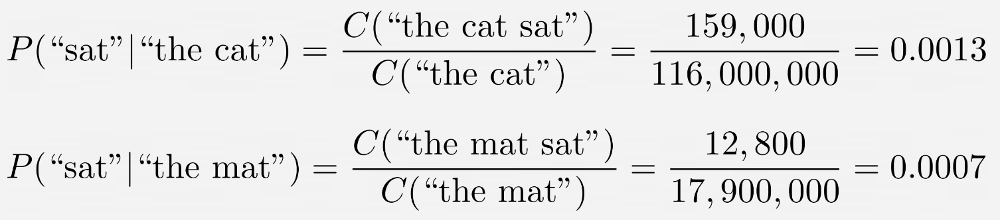
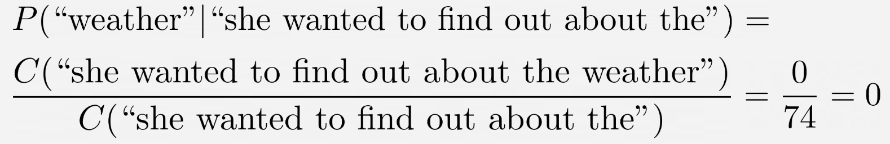
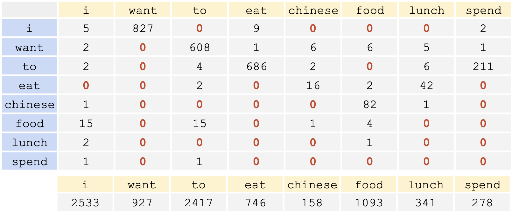

# Lecture 3: Language Model

Model Ideas:

1. Predict next word: *The next word in the sentence **...***
2. Predict a masked word: *The next **...** in the sentence is*

## N-Gram

我们期望计算：
$$
\begin{align*}
&P(w \mid h) \qquad \text{where } h \text{ is the history}\\
=& P(w_n \mid w_{1:n-1})

\end{align*}
$$

> Counting the likelihood
>
> 
>
> 
>
> 长历史可能会导致没有结果。

$$
\begin{align*}
\text{(Full Context) }&
  =P(w_n\mid w_{1:n-1})

\\\text{(Unigram) }&
  \approx P(w_n)
\\\text{(Bigram) }&
  \approx P(w_n \mid w_{n-1})
  
\\\text{(Trigram) }&
  \approx P(w_n \mid w_{n-2}, w_{n-1})

\\\text{(Quadgram) }&
  \approx P(w_n \mid w_{n-3}, w_{n-2}, w_{n-1})

\\\text{(N-gram) }&
  \approx P(w_n \mid w_{n-N+1:n-1})
  =       P(w_n \mid w_{n-N+1}, \cdots, w_{n-2}, w_{n-1})
\end{align*}
$$

$$
\underbrace{
  P(w_n\mid w_{n-1}) =
  \frac{C(w_{n-1}w_n)}{C(w_{n-1})}
}_\text{Bigram}

\qquad
\underbrace{
  P(w_n\mid w_{n-N+1:n-1}) =
  \frac{C(w_{n-N+1}^{n-1}w_n)}{C(w_{n-N+1}^{n-1})}
}_\text{N-gram}
$$

N-gram 中 $N$ 的选择依赖于 Corpus size，corpus 大，则更大的 $N$ 是可能的。通常 Trigram 足够了。

### Example

$$
P(\text{to}\mid \text{want})=
\frac{C(\text{want to})}{C(\text{want})}=
\frac{608}{927}=0.6559
$$

## Perplexity

$$
\begin{align*}
  P(w_1, \cdots, w_n)
  &= P(w_1)P(w_2\mid w_1)
     P(w_3\mid w_1, w_2)\dots
     P(w_n\mid w_1^{n-1})
  \\&=
  \prod^n_{k=1}P(w_k \mid w_1^{k-1})
\end{align*}
$$

>需要注意的是，如果对于 $N$ gram，最后的 $P(w_n \mid w^{n-1}_1)$ 其实是 $P(w_n\mid w_{n-N+1}^{n-1})$

> **Example: 评估 Bi-gram Assumption**
>
> 假设 $P(\text{I} \mid \lang s \rang) = 0.5, P(\lang /s\rang\mid \text{food}) = 0.68$
>
> Sample: “I want Chinese food”
>
> 1. 添加 BoS 和 EoS（Beginning/End of Sentence)
> 2. “I want Chinese food” $\to$ `<s> I want Chinese food</s>`
>
> $$
> \begin{align*}
> &= P(\lang s\rang \text{ I want Chinese food }\lang /s\rang)\\
> &= P(\text{I} \mid \lang s \rang)
>    \cdot P(\text{want}\mid \text{I})
>    \cdot P(\text{Chinese} \mid \text{want})
>    \cdot P(\text{food} \mid \text{Chinese})
>    \cdot P(\lang /s\rang \mid \text{food})
> \\&=
> 0.25\cdot 0.33 \cdot 0.0065 \cdot 0.52 \cdot 0.68
> \end{align*}
> $$

$$
\begin{align*}
\text{Perplexity} &=
P(w_1, w_2, \dots, w_n)^{-\frac{1}{n}}

\\&=
  \sqrt[n]{\frac{1}{P(w_1, w_2, \dots, w_n)}}

\\&=
  \sqrt[n]{\frac{1}{\prod^n_{k=1}P(w_k \mid w_1^{k-1})}}
\\
\text{Bigram Perplexity} &=
  \sqrt[n]{\frac{1}{\prod^n_{k=1}P(w_k \mid w_{k-1})}}
\end{align*}
$$

> **Perplexity 中的：BoS 和 EoS**
>
> - 不包括`<s>` ：起始标记`<s>`通常不包含在 $n$ 中，因为我们无法预测它 - 它始终是第一个标记
>
> - 包括`</s>` ：结束标记`</s>`应该包含在 $n$ 中，因为我们确实预测它是序列的一部分

最小化 Perplexity 等价于 最大化概率。

> Perplexity 允许我们对于测试数据选择最佳 LM。
>
> 对于 LM1 和 LM2，最好的是拥有最低 Perplexity的LM。
>
> - Perplexity 对于每一个 test-set 是特定的。（更换test set会导致不同perplexity）
>
> - 怎样去做 tokenization 很重要

## CE to Perplexity

### Cross Entropy

Cross Entropy 被定义为如下
$$
H(T, q) = -\sum^N_{i=1} \frac{1}{N}\ln q(x_i)
$$

- $T$ 表示真实分布（训练数据）
- $q$ 表示预测的概率分布，也就是模型
- $N$ 是样本数量

> 在训练过程中，我们希望模型的预测分布 $q$ 尽可能接近真实分布 $T$，交叉熵的值越小，表示两个分布越接近。
>
> 当预测完全正确时（预测概率为1），$\log(1) = 0$，交叉熵达到最小值
>
> 当预测错误时（预测概率接近0），log值变大，交叉熵增大

这个公式是交叉熵的一般形式。让我来详细解释一下：
$$
H(P,Q) = -\sum_{x∈\mathcal{X}} p(x) \log q(x)
$$

- $P$ 代表真实分布（ground truth）

- $Q$ 代表预测分布（predicted distribution）

- $p(x)$ 是真实分布中事件x的概率

- $q(x)$ 是预测分布中事件x的概率

> **Cross Entropy from KL Divergence**
> $$
> \begin{align*}
> D_{KL}(P\,||\, Q)
>   &= \sum_{x \in \mathcal{X}} p(x) \log \frac{p(x)}{q(x)}
>   
>   \\&=\sum_{x \in \mathcal{X}} p(x) \log p(x)
>   - \sum_{x \in \mathcal{X}} p(x) \log q(x)
>   
>   \\&=-H(P) + H(P, Q)
>   \\&\geq 0
>       \qquad\qquad \text{iff. }P=Q \text{ 等号成立}
>   \\
> H(P,Q) &\geq H(P) \qquad \text{iff. }p(x)=q(x) \text{ 等号成立}
>   \\
> \text{Minimise }D_{KL}(P\,||\, Q)
>   &\Lrarr
>   \text{Minimise } H(P, Q)
>   \\&\Lrarr
>   \text{Minimise Cross Entropy}
> \end{align*}
> $$

我们基于整个 Corpus 的Loss 选择参数 $\theta$
$$
\text{arg}\min_\theta \frac{1}{N}
\sum^N_{i=1} -\log p_\text{model}(y^{(i)}\mid x^{(i)}; \theta)
$$

> Refer to: https://stats.stackexchange.com/questions/428937/mle-and-cross-entropy-for-conditional-probabilities

### CE to PPL

如果我们使用底数 $e$ 计算了 CE $H$：
$$
\text{Perplexity}(M) = e^H
$$
如果底数为 $2$，则 $\text{Perplexity}(M) = 2^H$

> 考虑 CE 的定义
> $$
> H=-\sum^N_{i=1}\frac{1}{N}\log_e q(x_i)
> $$
> 语言的交叉熵可以写作
> $$
> H=-\frac{1}{N} \log_e P(w_1, w_2, \dots, w_N)
> $$
> 和 Perpexity 的定义
> $$
> \begin{align*}
> 
> \text{PPL}&=
> \left\{
> 
> \prod^n_{k=1}P(w_k \mid w_1^{k-1})
> \right\}^{-\frac{1}{n}}
> \\&=(P(w_1, w_2, \dots, w_N))^{-\frac{1}{N}}
> 
> \end{align*}
> $$

## Extrinsic vs Intrinsic Evaluation

如果您的语言模型的目标是为了支持另一个任务：

- 最佳的语言模型选择是能够最大程度改善下游任务性能的模型（外在评估）

在这种情况下，困惑度（perplexity）的参考价值较低（内在评估）

> 1. 外在评估（Extrinsic evaluation）：
>
>    - 关注模型在实际应用场景中的表现
>    - 评判标准是模型能否有效改善具体任务的性能
>    - 这是一种更实用的评估方式，因为它直接关注最终目标
>
> 2. 内在评估（Intrinsic evaluation）：
>
>   - 包括像困惑度（perplexity）这样的内部指标
>   - 测量模型在语言建模本身的表现
>   - 在实际应用场景中，这种评估方式的参考价值可能较低