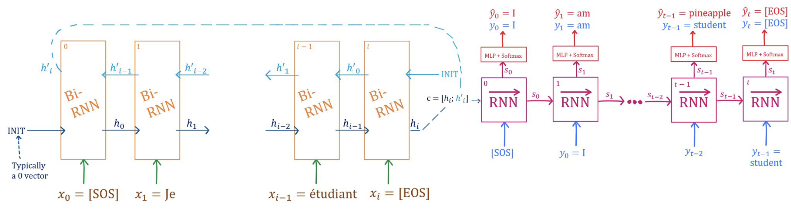
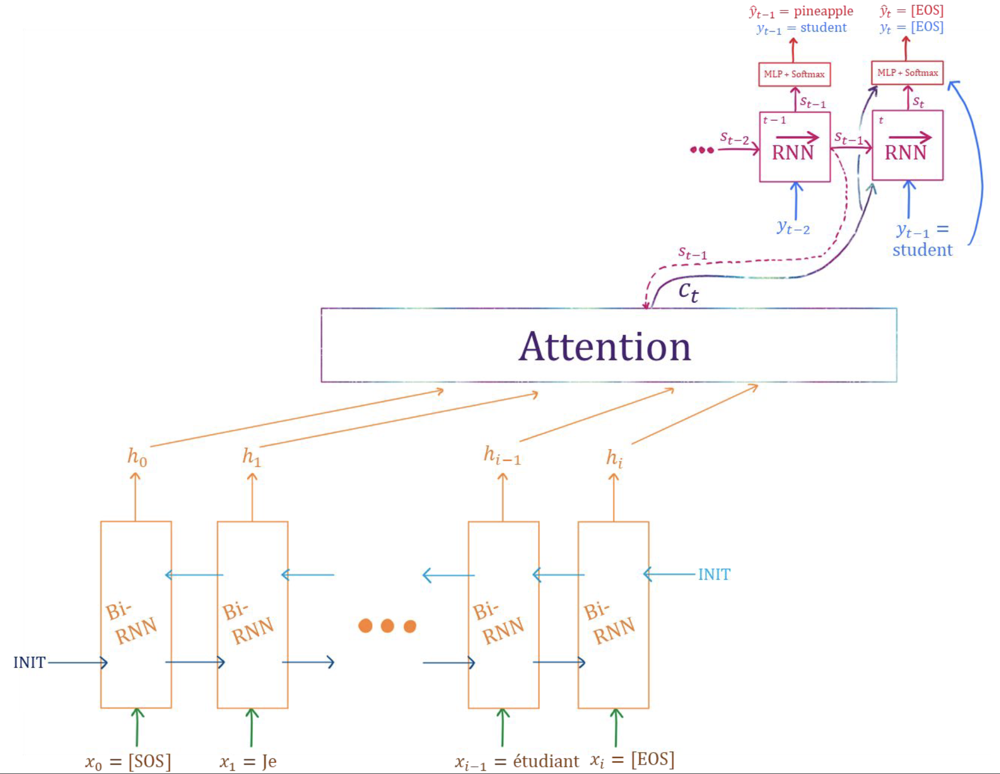
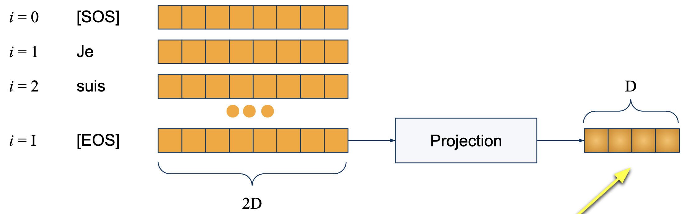
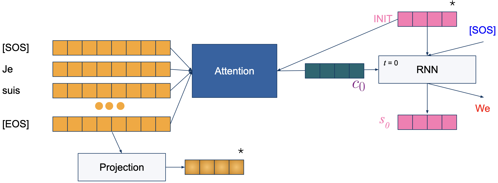

# Lecture 4: Machine Translation

## SMT: Statistical Machine Learning

## NML: Neural Machine Learning

Encoder-Decoder
$$
\mathcal{X} \xrightarrow{Enc} \mathcal{H} \xrightarrow{Dec} \mathcal{Y}
$$

### Naive Approach: ED BiRNN

$$
\text{BiRNN} \to c \to \text{RNN}
$$
我们考虑把输入怼入？考虑RNN的最后一层的隐藏层为 $h$，BiRNN则为 $h^\larr_0, h^\rarr_t$

可以将输出转换为 $h_t^\to$ 或 $[h^\to_t, h^\larr_0]$ 或 $[\overline{\{h^\to_1,h^\to_2,\dots,h^\to_t\}}, \overline{\{h^\larr_1,h^\larr_2,\dots,h^\larr_t\}}]$

如令 $h\in H\times 1$, 则$h'\in 2H\times1$。为了让 $h' \in 2H\times 1$ 变为 $H\times1$ 可以用 Projection。

Teacher Forcing (Avoid Accumulation of Errors)
$$
\begin{align*}
c &= Enc(\mathcal{X})\\
\hat{y}_t &= \text{Softmax}(W_O \cdot D(y_{<t}; c)) \text{ where }W_O\in\mathbb{R}^{h\times |V|}
\\
\text{Minimise}&-\sum^T_{t=1}\log p(\hat{y}_t \mid y_{<D}; c)
\end{align*}
$$

### MLP Attention

> 不同种类的 Attention：
>
> - **Additive/MLP**
> - Multiplicative
> - Self-attention

$$
c_t= \sum^I_{i=1}\alpha_i h_i
$$

#### Step 1: Final Hidden State

#### Step 2: Start Decoding

我们使用 Energy Score $e$ 获得近似度。对于每个单词 $w_i$ 计算其 score：
$$
e_i = a(s_{t-1}, h_{i}) = a(h^d_{t-1}, h^e_{i})
$$
对于获得的所有分数，我们可以对所有分数进行concate，然后做 Softmax：
$$
[\alpha_1, \alpha_2, \dots, \alpha_N] = \text{Softmax}([e_1, e_2, \dots, w_N])
$$

> **Alignment Function $a$**
> $$
> a(h^d_i, h^e_j) = v^\top \tanh (\overbrace{Wh^d_i}^{H\times1}  + \overbrace{U h^e_j}^{H\times 1})
> \\
> \text{where }
> \begin{align*}
> h^d_i &\in H\times 1 & W&\in H\times H\\
> h^e_j &\in 2H\times 1 & U &\in H\times 2H\\
> v &\in H\times 1 & a & \in [-1, 1]
> \end{align*}
> $$
> 

$$

$$
