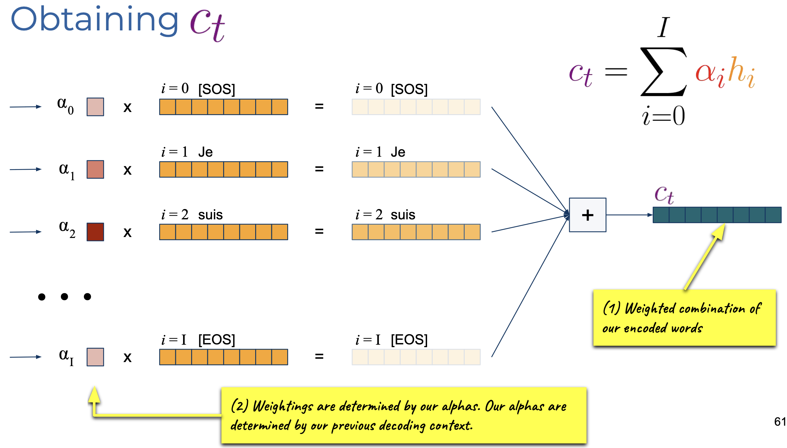

# Lecture 4: Machine Translation

[TOC]

## SMT: Statistical Machine Learning

## NML: Neural Machine Learning

Encoder-Decoder
$$
\mathcal{X} \xrightarrow{Enc} \mathcal{H} \xrightarrow{Dec} \mathcal{Y}
$$

### Naive Approach: ED BiRNN

$$
\text{BiRNN} \to c \to \text{RNN}
$$
我们考虑把输入怼入？考虑RNN的最后一层的隐藏层为 $h$，BiRNN则为 $h^\larr_0, h^\rarr_t$

可以将输出转换为 $h_t^\to$ 或 $[h^\to_t, h^\larr_0]$ 或 $[\overline{\{h^\to_1,h^\to_2,\dots,h^\to_t\}}, \overline{\{h^\larr_1,h^\larr_2,\dots,h^\larr_t\}}]$

如令 $h\in H\times 1$, 则$h'\in 2H\times1$。为了让 $h' \in 2H\times 1$ 变为 $H\times1$ 可以用 Projection。

Teacher Forcing (Avoid Accumulation of Errors)
$$
\begin{align*}
c &= Enc(\mathcal{X})\\
\hat{y}_t &= \text{Softmax}(W_O \cdot D(y_{<t}; c)) \text{ where }W_O\in\mathbb{R}^{h\times |V|}
\\
\text{Minimise}&-\sum^T_{t=1}\log p(\hat{y}_t \mid y_{<D}; c)
\end{align*}
$$

### MLP Attention

> 不同种类的 Attention：
>
> - **Additive/MLP**
> - Multiplicative
> - Self-attention

$$
c_t= \sum^I_{i=1}\alpha_i h_i
$$

#### Step 1: Final Hidden State

#### Step 2: Start Decoding

我们使用 Energy Score $e$ 获得近似度。对于每个单词 $w_i$ 计算其 score：
$$
e_i = a(s_{t-1}, h_{i}) = a(h^d_{t-1}, h^e_{i})
$$
对于获得的所有分数，我们可以对所有分数进行concate，然后做 Softmax (Normalise)：
$$
[\alpha_1, \alpha_2, \dots, \alpha_N] = \text{Softmax}([e_1, e_2, \dots, w_N])
$$

> **Alignment Function $a$**
> $$
> a(h^d_i, h^e_j) = v^\top \tanh (\overbrace{Wh^d_i}^{H\times1}  + \overbrace{U h^e_j}^{H\times 1})
> \\
> \text{where }
> \begin{align*}
> h^d_i &\in H\times 1 & W&\in H\times H\\
> h^e_j &\in 2H\times 1 & U &\in H\times 2H\\
> v &\in H\times 1 & a & \in [-1, 1]
> \end{align*}
> $$
> 

$$
c_t= \sum^I_{i=1}\alpha_i h_i
$$

## Evaluation

人类评估：好但是贵
自动评估：基于 Count Statistics of nGram，BertScore 是非 NGram的Model-based metric

### Modified Precision (MP)

#### MP-1

| N-Gram      | the  | cat  |  on  | mat  |
| ----------- | :--: | :--: | :--: | :--: |
| Count Ref 1 |  2   |  1   |  1   |  1   |
| Count Ref 2 |  1   |  1   |  1   |  1   |
| Max (Token) |  2   |  1   |  1   |  1   |

SUM_ngram = |the cat the cat on the mat| = 7
sum_max_count = 5
MP = 5/7

> 如果
>
> | N-Gram      | the  | cat  |  on  | mat  |
> | ----------- | :--: | :--: | :--: | :--: |
> | Count Ref 1 |  2   |  1   |  1   |  1   |
> | Count Ref 2 |  1   |  5   |  1   |  1   |
> | Max (Token) |  2   |  5   |  1   |  1   |
>
> SUM_ngram = |the cat the cat on the mat| = 7
> sum_max_count = (2+5+1+1) = 9
> MP = 9/7

#### MP-2

|   2-Gram    | the cat | cat the | cat on | on the | the mat |
| :---------: | :-----: | :-----: | :----: | :----: | :-----: |
| Count Ref 1 |    1    |    0    |   0    |   1    |    1    |
| Count Ref 2 |    0    |    0    |   1    |   1    |    1    |
| Max (Token) |    1    |    0    |   1    |   1    |    1    |

unique_ngrams = 5
sum_max_count = 1+1+1+1 = 4
total_grams = 6
MP = 4/6
$$
p_n = \text{MP-}N=\frac{\sum\max (\text{count }n\text{ in any reference})}{\text{Total }N\text{-grams}}
$$

#### BLUE

$$
p_n = \frac{\text{Total Unique Overlap}_n}{\text{Total }n\text{-grams}}
$$

$$
\text{BLUE-4}=\text{BP}
\left(
\prod^4_{n}p_n
\right)^{\frac{1}{4}}

\\

\text{BP} = \min\left(
1, \frac{\text{MT Output Length}}{\text{Reference Length}}
\right)
$$

简短惩罚(BP, Brevity Penalty)

> 例：the cat the cat on the mat
>
> | N-Gram              |  the  |  cat  |  on   |  mat  |
> | ------------------- | :---: | :---: | :---: | :---: |
> | Count Ref 1         |   2   |   1   |   1   |   1   |
> | Count Ref 2         |   1   |   5   |   1   |   1   |
> | Max (Token) $t$     | **2** |   5   | **1** | **1** |
> | Count(MT) $s$       |   3   | **2** | **1** | **1** |
> | Clip ($\min(t, s)$) |   2   |   2   |   1   |   1   |
>
> total_ngram= 7
> p1 = (2+2+1+1) / 7 = 6/7

### Chr-F & TER

- 

简单来说，它通过比较翻译结果和参考译文在字符级别的相似度来评估翻译质量

> MT: 北京是中华人民共和国的首都
> Ref: 北京是中国的首都
>
> 2-gram MT: 北京、京是、是中、中华、华人、人民、民共、共和、和国、国的、的首、首都
> 2-gram Ref: 北京、京是、是中、中国、国的、的首、首都
>
> Count = Min({MT Token in Ref}, {Overlap Token in MT}) ; Count = |MT| = 12
> Precision = 6/12 = .5 (北京、京是、是中、国的、的首、首都)
>
> Count = Min({Ref Token in MT}, {Overlap Token in Ref}) ; Count = |Ref| = 7
> Recall = 6/7
>
> F_beta

#### TER: Translation Error Rate

- 衡量将机器翻译结果（hypothesis）转换成参考译文所需的最少编辑次数
- 编辑操作包括插入、删除、替换和移动等
- 分数越低越好，因为这表示需要的修改越少

> Chr-F在字符级别工作，对中文、日文等无空格分词的语言特别有效
>
> TER直观地反映了后期编辑所需的工作量，对实际应用很有参考价值

### ROUGE: Recall-Oriented Understudy for Gisting Evaluation

#### ROUGE-$n$

用于测量参考文本和系统输出之间的 $n$-gram 的 $F-Score$

常用的有ROUGE-1（unigram）、ROUGE-2（bigram）等

#### ROUGE-L

计算参考文本和系统输出之间最长公共子序列（LCS, Longest Common Subsequence）的F Score

- 子序列不要求连续，但需要保持原有顺序
- 相比ROUGE-$n$，它能捕捉到更长距离的匹配模式

> Ref: "The cat is on the mat"
> Hyp: "The cat and the dog"
> LCS: "the cat the"
> Precision = LCS长度/系统输出Hyp长度 = 3/5
> 召回率(Recall) = LCS长度/参考文本Ref长度 = 3/6

> 优势
>
> 1. 自动识别最长匹配序列
> 2. 不需要预先指定n-gram的长度
> 3. 对词序敏感但允许间隔

### METEOR: Metric for Evaluation of Translation with Explicit ORdering

1. 单词级别的精确度和召回率计算：

   - Recall(R)的权重是Precision(P)的9倍

   - 这表明METEOR更看重召回率，即更关注翻译是否保留了原文的所有信息

2. n-gram块(chunks)的概念：

   - 理想情况：翻译输出(Hyp)只有1个块，意味着完全匹配参考译文(Ref)

   - 非理想情况：翻译输出有多个不连续的n-gram块

   - 块数越多，惩罚越大（因为这表明翻译结果的流畅度较差）

3. 词汇多样性考虑：

   - 词干提取(stemming)：比如"running"和"run"会被视为匹配

   - 同义词匹配：考虑词义相近的不同表达

   - 这使得METEOR比BLEU更灵活，更接近人类的评判标准

> Ref: "The cat is running quickly"
> Hyp1: "The cat runs fast" （较好：词干匹配、同义词匹配）
> Hyp2: "The quick cat the is" （较差：多个不连续块）
>
> 匹配过程：
>
> - 精确匹配："The", "cat", "is"
> - 同义词匹配："sleeping"/"napping" 这种情况下：
>   - 所有词都匹配上了
>   - 只有一个连续块
>   - 会得到较高的METEOR分数

> Ref: "The cat is sleeping"
> Hyp: "The is cat ewhfivucsdh"
>
> 精确匹配："The", "is", "cat"
> 无法匹配："ewhfivucsdh" 与 "sleeping"
> 匹配单词数(um) = 3
>
> 块分析
>
> | Chunk 1 | Chunk2 | Chunk 3 |
> | :-----: | :----: | :-----: |
> |   The   |   is   |   cat   |
>
> 总块数 = 3
> c = 块数-1 = 2
> $$
> \begin{align*}
> \text{Precision}
> &= \frac{\text{匹配词数}}{\text{翻译长度 Hyp}} = \frac{3}{4}
> 
> \\
> \text{Recall}
> &= \frac{\text{匹配词数}}{\text{参考长度 Ref}} = \frac{3}{4}
> \end{align*}
> $$
>
> $$
> \begin{align*}
> \alpha&=9\\
> \text{F-mean} &=
> \frac{P\cdot R\cdot(1+\alpha)}{\alpha P + R} = \frac{0.75\cdot0.75\cdot10}{9\cdot0.75 + 0.75}=0.75
> \\
> \text{Penalty} &= \gamma\times (\frac{c}{um})^\beta
> \\
> &=0.5(0.667)^3
> \\
> &\approx 0.148
> \\
> \text{Score} &= \text{F-mean} \times (1 - \text{Penalty}) = 0.75 * (1 - 0.148) \approx 0.639
> \end{align*}
> $$

> METEOR的优势：
>
> 1. 考虑同义词，使评估更符合语义层面
> 2. 通过块惩罚机制关注翻译的流畅度
> 3. 比BLEU更接近人类判断
> 4. 对单句翻译的评估更准确

### BERT Score

BertScore是一种评估文本相似度的度量方法，主要用于评估机器翻译、文本生成等任务的质量。从图中可以看出其工作原理包含以下几个关键步骤：

1. 文本嵌入表示：

   - 使用BERT模型将参考文本(Reference)和候选文本(Candidate)转换为 Contextual Embedding 表示

   - 每个词都会获得一个包含语义信息的向量表示

2. 计算相似度矩阵：

   - 对 Ref 和 Candidate (Hyp) 中的每个词向量进行两两配对

   - 使用 Cosine Similarity 计算每对词向量之间的相似程度

   - 生成一个相似度矩阵，展示所有词对的相似度得分

3. 最大相似度匹配：

   - 对每个词找到与之最相似的匹配词（图中用红色框标注）

   - 采用贪心匹配策略选择最佳匹配对

4. 重要性加权（可选）：

   - 可以使用IDF(逆文档频率)等方式对不同词的重要性进行加权

   - 这样可以让重要词语在最终得分中占更大权重

5. 计算最终得分：

   - 将所有匹配对的得分按照权重进行加权平均

   - 得到最终的BERT Score分数

BertScore的优势在于：
- 利用了BERT的强大语义理解能力
- 考虑了词语的上下文含义，而不是简单的字面匹配
- 能够捕捉同义词和相近表达
- 通过权重机制突出重要信息

这种评分方式比传统的基于n-gram的方法(如BLEU)更能体现文本的语义相似度。

## Inference

训练时，使用 Teacher Forcing。但是在推理时，无 Ground Truth。

在 Decode 时，可以进行：

- Greedy Decoding
- Beam Search
- Temperature Sampling

### Greedy Decoding

### Beam Search

### Temperature Sampling

当前问题：采样方法都是deterministic

我们可以用采样来替代argmax...但是softmax可能会过于"尖峰化"

温度采样可以帮助解决这个问题，具体方法是：

- 步骤1：将logits除以温度参数T，然后运行softmax
- 步骤2：对softmax概率进行多项式采样

$$
y \sim  \frac{\exp(y_i /T)}{\sum_{j=1}^N\exp(y_j / T)}
$$

$T \to 0$：接近于argmax（确定性选择）
$T < 1$：使分布更尖锐，更确定性
$T = 1$：标准 Softmax
$T > 1$：使分布更平缓，增加随机性
$T\to\infty$：接近于均匀分布（完全随机）
