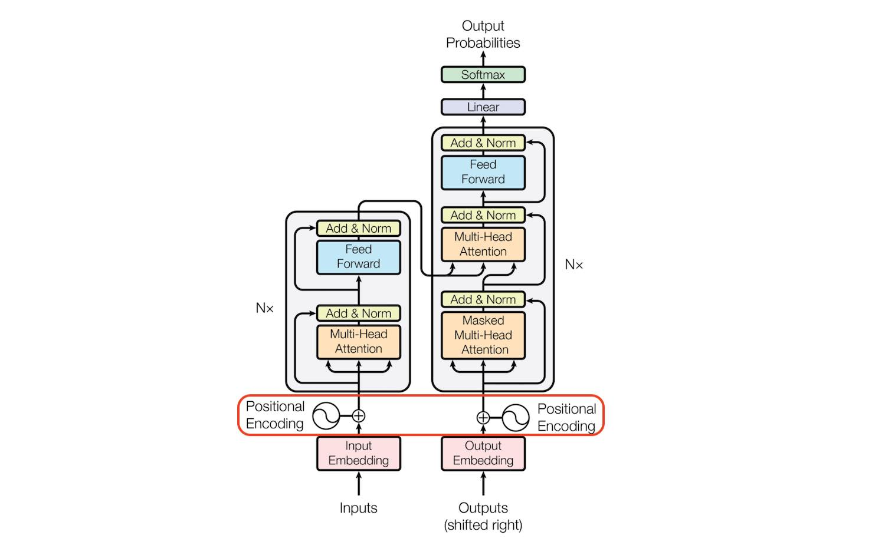

# Lecture 5: Transformer


|  |  |  |
| :----------------------------------------------------------: | :----------------------------------------------------------: | :----------------------------------------------------------: |
|  |  |  |


## Self-Attention (QKV)

$$
\text{Self-Attention}(Q, K, V)
=
\text{Softmax}\left(\frac{QK^\top}{\sqrt{d_h}}\right)V
$$

$Q$: Query
$K$: Key
$V$: Value
$d_h$: Hidden/Head Dimension（隐藏维度或头维度），scaled dot-product attention。

> 如果一个 Transformer 模型的隐藏维度是 512，有 8 个注意力头，那么每个头的 $d_h$ 就是 64

通过映射可以获得词向量，即：
$$
\omega_1, \omega_2\dots, \omega_n
\xrightarrow{f} w_1, w_2,\dots,w_n
$$
之后计算 QKV
$$
\begin{align*}
E&=[w_1, w_2,\dots]
& E&\in \mathbb{R}^{N\times E}
\\
Q &= W_Q E
& W_Q &\in\mathbb{R}^{E\times d_Q}
&Q &\in \mathbb{R}^{N\times d_Q}
\\
K &= W_K E
& W_K &\in\mathbb{R}^{E\times d_Q}
&K &\in \mathbb{R}^{N\times d_Q}
\\
V &= W_V E
& W_V &\in\mathbb{R}^{E\times d_V}
&V &\in \mathbb{R}^{N\times d_V}
\end{align*}
$$

由于通常
$$
\begin{align*}
d_Q = d_V =d_h
\end{align*}
$$
其中 $d_h$ 是每个 Head 的维度，也就有：
$$
\begin{align*}
E&=[w_1, w_2,\dots]
& E&\in \mathbb{R}^{N\times E}
\\
Q &= W_Q E
& W_Q &\in\mathbb{R}^{E\times d_h}
&Q &\in \mathbb{R}^{N\times d_h}
\\
K &= W_K E
& W_K &\in\mathbb{R}^{E\times d_h}
&K &\in \mathbb{R}^{N\times d_h}
\\
V &= W_V E
& W_V &\in\mathbb{R}^{E\times d_h}
&V &\in \mathbb{R}^{N\times d_h}
\end{align*}
$$
SA：
$$
\begin{align*}
\text{Similarity} \in \mathbb{R}^{N\times N}
&= QK^\top
\\
\sqrt{d_h} &\in\mathbb{R}
\\
\boldsymbol{\lambda}
\in\mathbb{R}^{N\times N}
&= \text{Softmax}\left(\frac{QK^\top}{\sqrt{d_h}}\right)
\text{ (Attention Matrix)}
\\
\text{Self-Attention}\in\mathbb{R}^{N\times d_V}
&=  \text{Softmax}\left(\frac{QK^\top}{\sqrt{d_h}}\right)V

\end{align*}
$$

> **Scaled Dot-Product Attention：归一化项 $$\sqrt{d_h}$$**
> $$
> \begin{align*}
> \text{Scaled Dot-Product Attention}(Q,K,V)=
> \text{Softmax}\left(\frac{QK^\top}{\sqrt{d_h}}\right)V
> 
> \\
> \text{Dot-Product Attention}(Q, K, V)=
> \text{Softmax}\left(QK^\top\right)V
> \end{align*}
> $$
> 
>
> $\sqrt{d_h}$ 主要原因是为了控制 dot product 的数值范围，避免梯度消失或梯度爆炸问题。
>
> > **$$QK^\top$$ 的方差**
> >
> > 假设 $Q$ 和 $K$ 中的每个元素都是 $\mu=0, \sigma^2 =1$ 的独立随机变量
> >
> > 当我们计算两个向量的点积时，会将 $d_h$ 个数相乘并相加
> >
> > 最终方差将是 $$d_h$$
>
> 如果不进行缩放，当 $$d_h$$ 较大时，点积的结果会有很大的方差。这会导致 softmax 函数的输入有非常大的数值。
> softmax会将大的正数变得接近 $1$，将其他值变得接近 $0$，这种情况下梯度会变得非常小，影响模型的训练。
>
> 除以 $$\sqrt{d_h}$$ 将点积的方差重新归一化到 $1$，使得 softmax 的输入分布更加合理，保持梯度在一个适当的范围内。
>
> 这种缩放方法类似于Xavier初始化中的思想，目的都是为了保持各层的梯度在合理范围内，使得网络能够更好地训练。

## Multi-Head Attention


Multi Head Attention 类似于：

```
MultiHeadAttention n = fork n; [mfork n Attention]
```

在原论文里 $h=8$, 因此我们有 8 个不同的 $QKV$。也就是 $W_{Q,1:8}, W_{K,1:8},W_{V,1:8}$。

如果我们把 $n$ 个 head 矩阵concat起来，就会变成
$$
\begin{align*}
W_{Q,n}   &\in \mathbb{R}^{E\times d_h}\\
W_{Q,1:n} &\in \mathbb{R}^{E\times \underbrace{(n\times d_h)}_{D}}
\end{align*}
$$
对于每个 Head，其涉及到的 $d_h$ 就是
$$
d_h = \frac{D}{n}
$$

### Cross Attention


|  |  |
| :----------------------------------------------------------: | :----------------------------------------------------------: |
|                        Self Attention                        |                       Cross Attention                        |

Decoder 需要合并 Encoder 给出的信息。使用 CA 实现 Merged View。

使用 Encoder 最后一层，计算 $K, V$，使用 Decoder 的层计算 $Q$。如考虑 Encoder 有 $N\times d_h$，而 Decoder 有 $M\times d_h$，则 Attention Matrix 有 $N\times M$


### Masked Attention


## Normalisation

$$
\hat{x} = \frac{x - \mu}{\sigma}
$$

### Layer Normalisation

考虑一个 batch
$$
B=\{x_1, x_2, \dots, x_n \}\qquad x_n\in \mathbb{R}^{d}
$$
Step 1: Normalise $\hat{x}_n = \text{Normalise}(x_n)$

Step 2: Transform with $\gamma, \beta$
$$
\text{LN}(\hat{x}_n) = \gamma\hat{x}_n + \beta
\qquad
\gamma \in \mathbb{R}^d,
\beta  \in \mathbb{R}^d
$$


$\gamma, \beta$ 参数的作用是让 NN 学习 Normalised 后每个特征的最佳 scale 和 shift。

通过将这些学习到的参数应用于归一化特征向量，NN 可以调整每个特征的 range 和 mean，以更好地适应手头的任务。

> 这样设计的主要原因是为了提供特征级别的缩放和平移能力：
>
> - 不同特征可能需要不同程度的归一化后的调整
> - 允许模型学习每个特征维度最优的缩放和偏移参数
> - 如果是标量的话，所有特征会被统一缩放，这会限制模型的表达能力
> - 特征级别的参数可以帮助保留原始特征的相对重要性
>
> 举个例子：在语言模型中，某些 token 位置的特征可能需要更大的缩放系数来强调其重要性，而其他位置可能需要较小的缩放系数。向量化的 $\gamma$ 和 $\beta$ 提供了这种灵活性。

> 当输入是 `(batch_size, n_features)` 时：
>
> - 计算均值和方差是在最后一个维度 `n_features` 上进行
> - 每个样本会得到一个归一化统计量
> - $\gamma$ 和 $\beta$ 的形状是 `(n_features,)`
>
> 当输入是 `(batch_size, sequence_length, n_features)` 时：
>
> - 计算均值和方差仍然是在最后一个维度 `n_features` 上进行
> - 对每个序列位置都独立计算归一化统计量
> - $\gamma$ 和 $\beta$ 的形状保持 `(n_features,)`
> - 会对 `sequence_length` 这个维度上的每个位置都独立进行归一化

### Residual Connections


Theory：如果我们 Stack Layers，就能降低 Training Error
Practice (Red)：笑不出来
Residual Connections (Blue): hold my activations

残差连接有助于缓解梯度消失问题
Vanishing Gradients = Tiny Weight Changes

> **Residual Connection 如何帮助缓解梯度消失问题**
>
> 让我们通过数学和直观的理解来分析:
>
> 1. 传统网络中的梯度流动
>
> 在一个传统的深度网络中,信号需要经过多层非线性变换:
> $$
> y = f(x) = f_L(...f_2(f_1(x)))
> $$
>
> 反向传播时,梯度需要连乘所有层的雅可比矩阵:
> $$
> \frac{\partial L}{\partial x} = \frac{\partial L}{\partial y} \cdot \frac{\partial f_L}{\partial f_{L-1}} \cdot ... \cdot \frac{\partial f_1}{\partial x}
> $$
>
> 由于每层的雅可比矩阵通常范数小于1,连乘后梯度会呈指数衰减。
>
> 2. 残差连接的作用
>
> 添加残差连接后,每一层的输出变为:
> $$
> y = F(x) + x
> $$
>
> 此时反向传播的梯度变为:
> $$
> \frac{\partial L}{\partial x} = \frac{\partial L}{\partial y} \cdot 
> 
> \left(\frac{\partial F(x)}{\partial x} + 1
> \right)
> $$
>
> 这个公式展示了残差连接的关键作用:
>
> - 梯度可以通过跳跃连接(+1项)直接流回前层,不会被衰减
> - 即使F(x)的梯度很小,+1保证了总梯度不会消失
> - 网络可以选择是否使用残差路径,增加了模型的表达能力
>
> 通过这种方式，残差连接为梯度提供了一条"高速公路",使得深层网络也能有效训练。这也是为什么ResNet能够训练超过100层的网络的重要原因之一。

## Position-wise Feedforward Network

$$
\text{FNN}(x) = \text{RELU}(xW_1+b_1)W_2 + b_2\\
W_1\in\mathbb{R}^{D\times d_\text{ff}}
\qquad
W_2\in\mathbb{R}^{d_\text{ff}\times D}
\qquad
d_\text{ff} = 2048
$$

## Positional Encodings




|  |  |
| :-----------------------------------------: | :----------------------------------------------------------: |
|               `embedding(x)`                |      `embedding(x) + get_positional_encoding_vector(s)`      |

sinusoids:
$$
\begin{align*}
\text{PE}_{pos,2i}&=\sin \left(
   \frac{pos}{10,000^{\frac{2i}{d}}}
\right)
\\
\text{PE}_{pos,2i+1}&=\cos \left(
   \frac{pos}{10,000^{\frac{2i}{d}}}
\right)
\end{align*}
$$
$pos$ 表示序列中的位置
$i$ 表示维度的索引
$d$ 表示模型的维度
$2i$ 表示偶数维度

其他的 PE 也有，甚至有 learnable PE（BERT）。PE 只依赖 word 的 index

> 例子：
> $$
> \text{pos} = 2\qquad \text{embedding} = \underbrace{[1.0, 1.1, 1.2, 1.3]}_{d=4}
> $$
> 
>
> |          i           |         Formula         |        Val        |
> | :------------------: | :---------------------: | :---------------: |
> | $i=0 \text{ (even)}$ | $\sin(2 / 10000^{0/4})$ |   $1.0+\sin(2)$   |
> | $i=1 \text{ (odd)}$  | $\cos(2 / 10000^{0/4})$ |   $1.1+\cos(2)$   |
> | $i=2 \text{ (even)}$ | $\sin(2 / 10000^{2/4})$ | $1.2+\sin(2/100)$ |
> | $i=3 \text{ (odd)}$  | $\cos(2 / 10000^{2/4})$ | $1.3+\cos(2/100)$ |

## Test & Training

### Testing


执行自动回归（auto-regressive）生成

1. 源句子通过 Encoder 进行 Encode
2. 向 Decoder 输入一个`[SOS]` 标记。然后它预测第一个词（即"I"）
3. 将预测结果附加到 `[SOS]` 标记后，然后用这个来预测下一个词（即"am"）
4. 如此继续。在某个时候，我们的解码器会预测出一个 `[EOS]` 标记（这里没有显示），就知道生成已经结束了。

### Training


在训练过程中，我们不会让模型自回归（auto-regressive）地生成输出。
实际上要将整个目标序列一次性输入解码器并完成解码

- 这意味着我们可以只运行一次 Encoder
- 与在 Testing 时为目标序列中的每个词元都运行一次解码器的方式不同

如果我们将整个序列输入解码器，我们需要一种方法来告诉解码器在计算某个词元的注意力时不要查看未来的词元。

- 例如，在计算"am"的基于注意力的表示时，我们不应该允许查看"a"或"student"，因为这些词元在未来
- 我们通过 Masking 来强制实现这种单向性

这种机制本质上是为了在训练时模拟推理时的自回归生成过程，同时提高训练效率。

也就是 Masked Multi-head Self-attention (Masked MHA)

## Other Tricks

作者在 Encoder 中使用权重绑定（weight tying）：共享输入嵌入矩阵（embedding matrix）和输出投影（output projection matrix）矩阵
- 输入嵌入矩阵（embedding matrix）：将输入词元转换为向量表示
- 输出投影矩阵（output projection matrix）：将解码器的隐藏状态转换为词表大小的logits

使用 Decaying LR
$$
lr=\sqrt{\frac{1}{d}}\times\min\left(
\frac{1}{d},
i \times\text{warm-up}^{-1.5}

\right)
$$


$i$ = current global step
$\text{warm-up}$ = hyperparameter (default: 4000)
$d$ = model dimensionality
