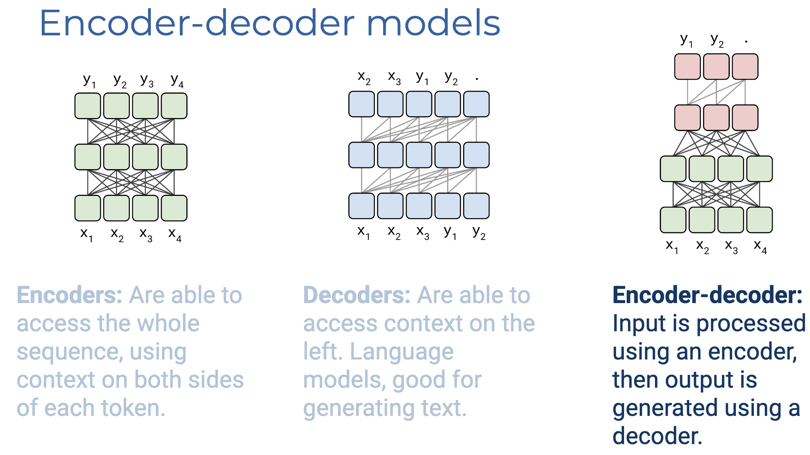
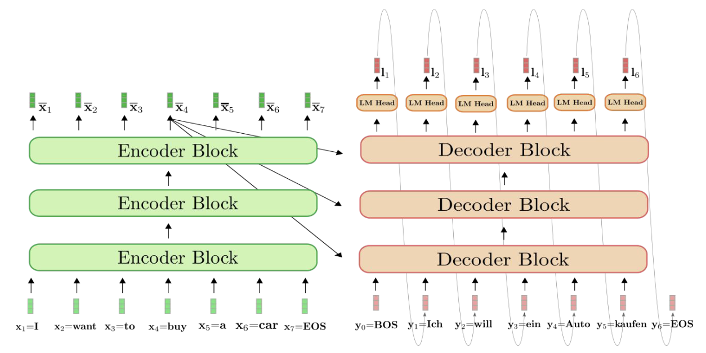
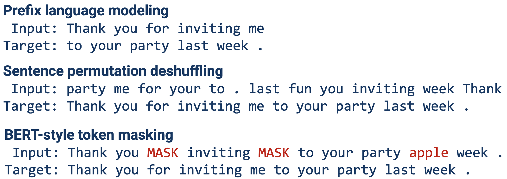
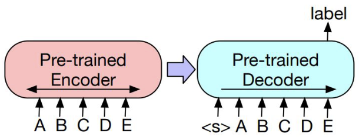
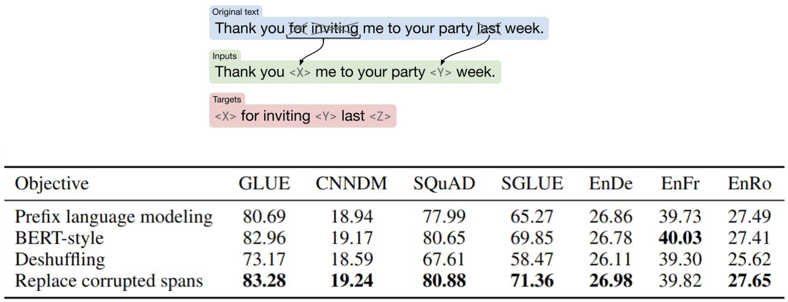
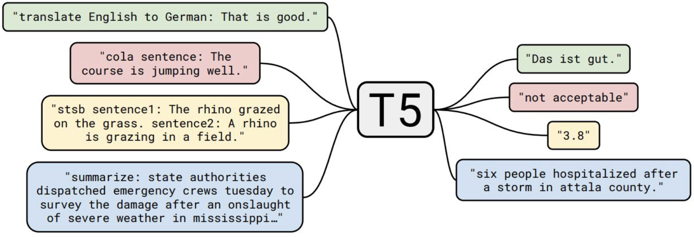
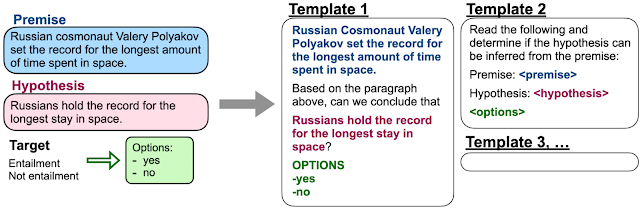
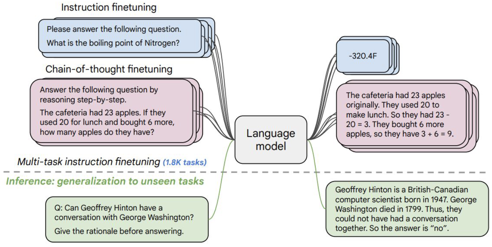

# Lecture 6.2 PreTrained Model: ED

输入序列可以通过 Encoder 进行 Fully Attented 处理，以获取最大信息。然后，使用专门的 Decoder 来生成输出序列。特别适用于机器翻译：编码器和解码器可以使用不同的词汇表，并专注于不同的语言。

MLM可能不能很好的进行建模：**缺乏 input 和output token 的直接对应**

## ED Pretrain

我们可以以各种不同的方式破坏原句，然后优化模型以重建原句。适用于生成任务。

对于ED使用分类任务，可以构建一个输出头，放在D的最后一个隐藏层

### SpanBERT-like Objective

替换损坏的 spans

### Instructional training: T5

T5 用的span corruption

为特定任务的输入加上特定字符串的前缀并不自然。
相反，可以使用模板将现有的数据集转换成听起来更顺耳的指令。

然后，我们可以将自然语言指令作为输入进行训练，并将注释答案作为目标输出。
FLAN-T5（Fine-tuned LAnguage Net，微调自然语言网络）的规模与 T5 相同，但训练的数据量更大，使用的语言更多，并有 1.8K 项任务以指令形式表达。

> Example
>
> Input: A step by step recipe to make bolognese pasta:
> Output: Melt the butter in a large skillet over medium-high heat. Add the sausage and cook, stirring occasionally, until browned on all sides, about 5 minutes. Stir in the bolognese sauce and salt and pepper to taste. Pour the sauce over the pasta and toss to coat. Cover the skillet with cling wrap and refrigerate until ready to use, at least 1 hour. Serve topped with Parmesan shavings and parsley sprigs, if desired, and drizzle with extra-virgin olive oil and balsamic vinegar. Garnish with grated Parmigiano cheese and roasted red pepper flakes. Makes 1 1/2 lb (450 g) servings. Note: If you'd like, you can add 1 cup (240 ml) of ricotta cheese for an additional 2 tbsp. of cheese. You can also add 2 tablespoons of chopped chives, 1 teaspoon each of oregano and basil, 2 teaspoons thyme, 1/4 teaspoon kosher salt, 1/2 teaspoon freshly ground black pepper and 1/8 teaspoon ground nutmeg to the mixture and stir to combine.

https://research.google/blog/introducing-flan-more-generalizable-language-models-with-instruction-fine-tuning/

https://research.google/blog/exploring-transfer-learning-with-t5-the-text-to-text-transfer-transformer/