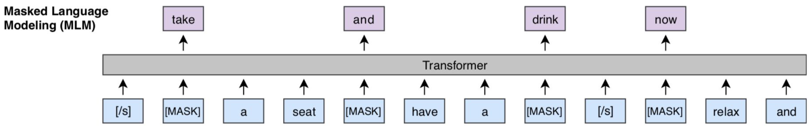
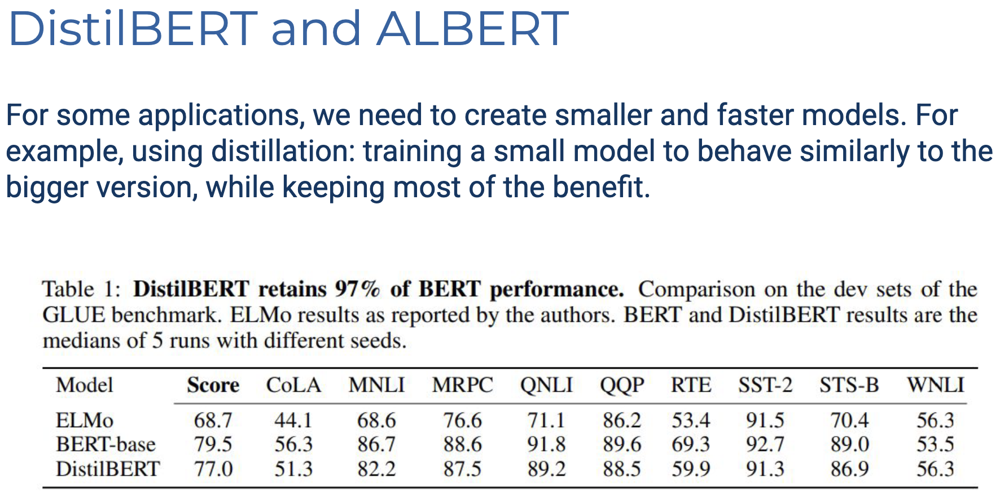

# Lecture 6 Pre-Trained Model

## Contextual Word Representations

Word的意思可能取决于其上下文，因此需要基于上下文构建 CWE（Contextual Word Embedding）。

我们可以认为对于一个大corpus，单词的意思由其上文和下文决定。因此可以构建如下两个 NN（RNN）：
$$
\begin{align*}
p^\to(t_1, \dots,t_N) &= \prod^N_{i=1} p(t_i \mid t_{1:i-1})
\\
p^\larr(t_1, \dots,t_N) &= \prod^N_{i=1} p(t_i \mid t_{i+1:N})


\end{align*}
$$


### ELMo: Embedding from Language Model


第一步先用 cnn-big-lstm 把词转换为词向量。其类似于 Word2Vec。然后使用预测任务进行语言建模。

## Pre-Training Encoders


### BERT: Bidirectional Encoder Representations


BERT的三种基本embedding: token/segmentaion/position embedding

Segment Embeddings (段嵌入)是用来区分不同句子或文本段落的嵌入向量。

1. **Token Embeddings (词元嵌入)**

   - 将输入文本中的每个token(单词或子词)转换为固定维度的向量表示

   - 从图中可以看到，每个输入token(如"my"、"dog"等)都被映射为对应的embedding (E_my, E_dog等)

   - 这些向量包含了词的语义信息

   - 特殊token如[CLS]和[SEP]也有自己的embedding表示

2. Segment Embeddings (段落嵌入)

   - 用于区分不同的句子或文本段落

   - 在图中使用EA表示第一个句子中的所有token

   - 使用EB表示第二个句子中的所有token

   - 这样模型就能知道每个词属于哪个句子

   - 对于句子对任务(如问答、文本蕴含等)特别重要

2. Position Embeddings (位置嵌入)

   - 由于Transformer结构本身不能捕获序列顺序信息

   - 使用Position Embeddings来表示每个token在序列中的位置

   - 从图中可以看到使用E0到E10来表示不同位置

   - 这使得模型能够理解词序对语义的影响

   - 例如"dog bites man"和"man bites dog"的意思完全不同

这三种Embeddings会被加在一起形成最终的输入表示：

- Final Embedding = Token Embedding + Segment Embedding + Position Embedding
- 三种Embedding的维度相同，可以直接相加
- 这种组合让模型同时获得了词义、句子归属和位置这三种重要信息

#### MLM: Masked Language Modeling




Mask 太少：训练太 expensive
Mask 太多：没有足够多的上下文进行预测


如果我们Mask所有选定的单词，模型就不一定会学会为 non-masked words 构建良好的表示。

#### NSP: Next sentence prediction


给定两个句子，预测它们是否以原始顺序出现在源文本中。
后来的研究发现，这并没有带来太多额外的好处，因此在较新的版本中没有使用。

#### Variant

| Model | BERT-base            | BERT-large |
| --- | -------------------- | ---------- |
| Layers | 12 Layers            | 24 Layers  |
| Hidden State | 768 dim | 1024 dim   |
| Attention Heads | 12 | 15 |
| Parameters | 110M | 340M |

训练数据：
- 图书语料库（8亿词）
- 英文维基百科（25亿词）

使用64个TPU芯片预训练，总计4天

## 与 Pre-Trained Model 工作

> BERT-like 只需要去掉那个预测头就可以直接获得 Token Rep.

**方案1：** 冻结BERT，用它来计算信息丰富的表示向量。 训练另一个以这些向量为输入的机器学习模型。

**方案2（现在更常见）：** 在BERT之上添加一个最小的神经网络架构（例如单个输出层） 对整个模型进行端到端训练（称为微调）。

> Sentence Classfication
>
> 

> Token Labeling
>
> 

> Sentence Pair Classification
>
> 

> Question Answering
>
> 
>
> ```
> 输入：
> [CLS] Who invented the telephone? [SEP] Alexander Graham Bell invented the telephone in 1876.
> 
> 输出：
> Start Span: "Alexander"的位置
> End Span: "Bell"的位置
> ```
>
> 预测只会在段落部分（[SEP]后的文本）中寻找答案位置
>
> 输出实际上是两个位置索引，而不是直接输出文本
>
> BERT会为每个可能的开始和结束位置计算概率分数
>
> Start Position输出：是一个长度为N的向量（N是段落中的token数量）（softmax）。最高概率的位置被选为答案的开始位置
>
> End Position输出也类似。

## Spin offs

### BERT Family





> ERNIE
>
> 1. "我们有现有的知识图谱,可以利用其中包含的信息。" 这说明ERNIE模型的一个重要特点是能够利用已有的结构化知识库(知识图谱)中的信息。
>
> 2. "由于文本中可以检测到实体,ERNIE在transformer中添加了特殊的实体嵌入以提供额外信息。" 这描述了ERNIE的一个创新点:
>
>    - 它能识别文本中的实体(如人名、地名、组织等)
>
>    - 为这些实体创建特殊的嵌入表示
>
>    - 将这些实体信息整合到transformer架构中
>
> 3. "一个独立的多头注意力机制作用于实体嵌入,然后通过融合层将信息与主模型结合。" 这解释了ERNIE如何处理实体信息:
>
>    - 使用单独的多头注意力机制处理实体嵌入
>
>    - 通过特殊的融合层将实体信息与模型的主要语言理解功能结合起来

### Multimodal Models

#### InageBERT


#### ViLBERT


#### MAE


#### Masked Protein Modelling


